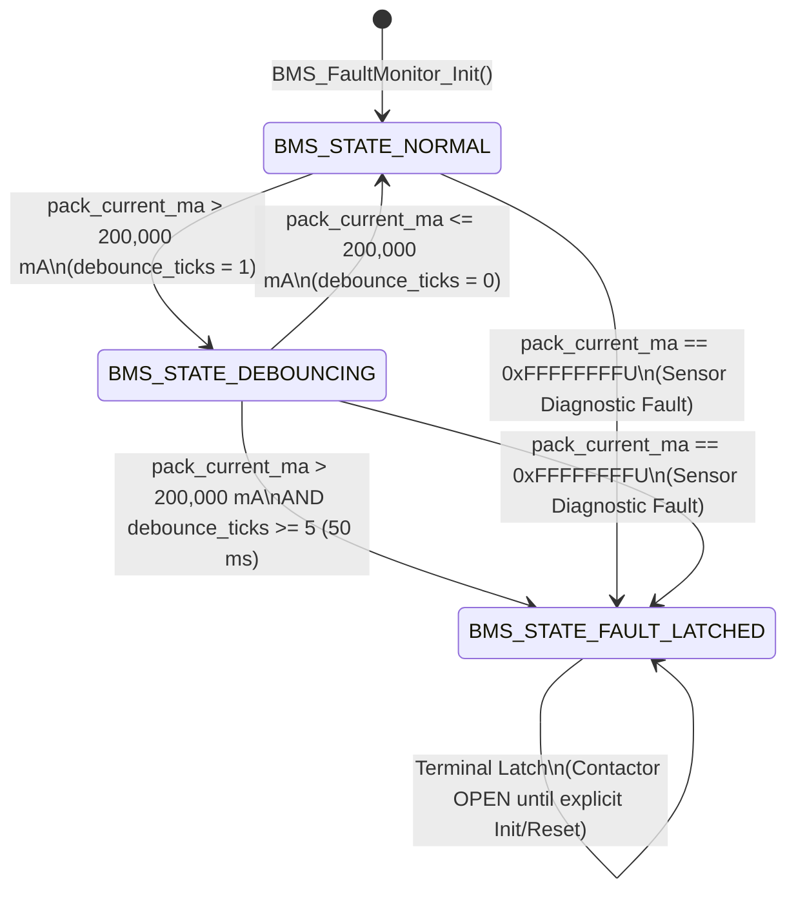

# Functional Safety Specification: PHEV/HEV High-Voltage Battery Pack & HPCU Contactor Overcurrent Monitor (`REQ-BMS-042`)

* **Document ID:** `REQ-BMS-042`
* **Subsystem:** PHEV/HEV High-Voltage Battery Pack & Hybrid Power Control Unit (HPCU) Contactor Protection
* **Safety Integrity Level:** ISO 26262 ASIL-C
* **Source Model:** `BMS_FaultMonitor_v2.slx` (Simulink Stateflow Cyclic 10ms Task)
* **Target Toolchain:** C99 (`-std=c99 -Wall -Wextra -Werror -Wpedantic -Wconversion -Wshadow`) / MISRA-C:2012 Compliant

---

## 1. Operational Overview

The BMS / HPCU Overcurrent Fault Monitor executes deterministically every **10 ms** (`BMS_TASK_PERIOD_MS = 10U`). It samples the rectified absolute high-voltage battery pack current ($\lvert I_{\text{pack}} \rvert$) from the memory-mapped ADC/CAN telemetry register and controls the high-voltage contactor driver register.

In hybrid electric vehicles (HEV / PHEV), the battery pack operates at **200–350 V** with a continuous/burst rating around **150–250 A** (providing 20–50 kW of hybrid boost assist). The pack routinely experiences steep bi-directional current spikes:
* **Discharge transients:** Internal Combustion Engine (ICE) crank assist and torque fill from the Integrated Starter-Generator (ISG / mild-hybrid boost motor).
* **Charge transients:** Aggressive regenerative braking current surges captured by the electric traction motor.

To prevent nuisance contactor trips during these sub-50ms operational transients while guaranteeing pack and silicon isolation during a sustained short-circuit or boost DC-DC converter failure, the monitor implements a **50 ms Fault Tolerant Time Interval (FTTI)** debounce window (**5 consecutive 10 ms ticks**).

---

## 2. State Machine Specification

### 2.1 Functional Requirements

| Req ID | Title | Specification |
|---|---|---|
| **REQ-BMS-042.1** | **Overcurrent Threshold** | Any rectified pack current reading strictly greater than **`200000UL` mA** ($200\text{ A}$) shall be classified as an overcurrent sample. |
| **REQ-BMS-042.2** | **50 ms FTTI Debounce Window** | When an overcurrent sample occurs, `debounce_ticks` shall increment by `1U`. If `debounce_ticks >= 5U` (`BMS_DEBOUNCE_LIMIT_TICKS`, corresponding to $5 \times 10\text{ ms} = 50\text{ ms}$), the state machine **must** transition to `BMS_STATE_FAULT_LATCHED` on that 5th tick, clear `BMS_REG_CONTACTOR_CLOSED_BIT`, set `BMS_REG_CONTACTOR_TRIP_BIT`, and set `BMS_FAULT_OVERCURRENT_BIT`. |
| **REQ-BMS-042.3** | **Transient Spike Rejection** | If `pack_current_ma <= 200000UL` while in `BMS_STATE_DEBOUNCING` (i.e. fewer than 5 consecutive ticks have elapsed), `debounce_ticks` shall reset to `0U` and the state shall return to `BMS_STATE_NORMAL` with the contactor remaining closed. |
| **REQ-BMS-042.4** | **Non-Volatile Fault Latching** | Once in `BMS_STATE_FAULT_LATCHED`, the contactor shall remain open (`BMS_REG_CONTACTOR_TRIP_BIT` asserted, `BMS_REG_CONTACTOR_CLOSED_BIT` cleared) regardless of subsequent current drops, until `BMS_FaultMonitor_Init()` is explicitly invoked. |
| **REQ-BMS-042.5** | **Sensor Fault & Null-Pointer Fail-Safe** | If `regs` or `state` is `NULL`, or if `regs->pack_current_ma == 0xFFFFFFFFU` (`BMS_SENSOR_INVALID_RAW`), the monitor shall immediately latch `BMS_STATE_FAULT_LATCHED`, open the contactor, and assert `BMS_FAULT_SENSOR_ERR_BIT`. |

---

## 3. Hardware Register Map (Base Address `0x40021000`)

| Offset | Register Name | Access | Bitfields | Description |
|---|---|---|---|---|
| `0x00` | `PACK_CURRENT_MA` | `RO` | `[31:0]` Unsigned milliamperes | Rectified absolute pack current magnitude ($\lvert I_{\text{pack}} \rvert$, `0xFFFFFFFFU` = sensor fault) |
| `0x04` | `CONTACTOR_CTRL` | `RW` | Bit 0: `CLOSED_EN` (`0x01U`) Bit 1: `TRIP_LATCH` (`0x02U`) | High-voltage contactor coil driver control |
| `0x08` | `FAULT_STATUS` | `RW` | Bit 0: `OVERCURRENT` (`0x01U`) Bit 1: `SENSOR_ERR` (`0x02U`) | Latched diagnostic fault flags for CAN broadcast |

---

## 4. Coding & Safety Compliance Rules (MISRA-C:2012 Subset)

1. **Zero Dynamic Heap Allocation (MISRA Dir 4.12 / Rule 21.3):** `malloc`, `calloc`, `realloc`, and `free` are strictly prohibited. All state resides in caller-allocated static structures.
2. **Fixed-Width Types Only (MISRA Dir 4.6):** Only `<stdint.h>` (`uint8_t`, `uint16_t`, `uint32_t`) and `<stdbool.h>` types are permitted in production headers and source files. Unqualified `int`, `long`, `float`, and `double` are banned.
3. **No Unstructured Control Flow or Recursion (MISRA Rule 15.1 / Rule 17.2):** `goto` and recursive function calls are banned.
4. **Memory Footprint Budget:** `.bss` + `.data` $\le 64\text{ bytes}$; `.text` $\le 2048\text{ bytes}$.
